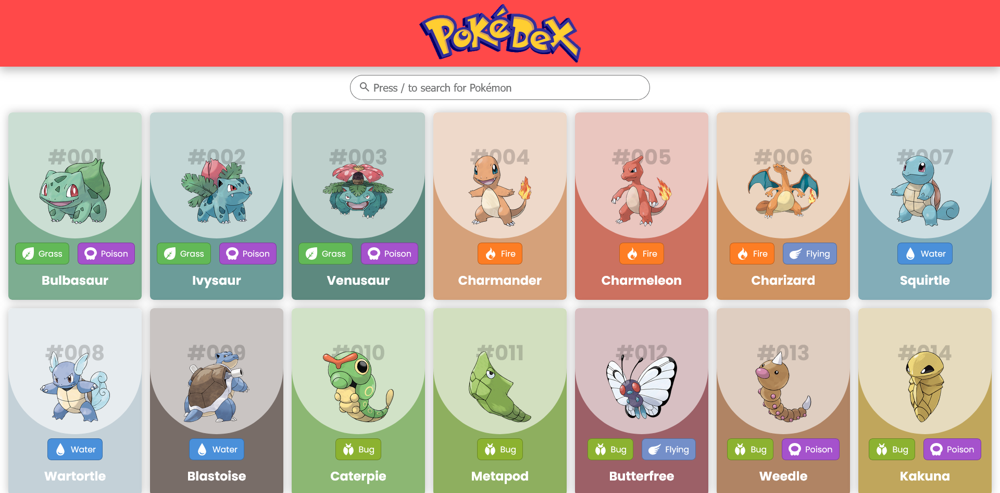
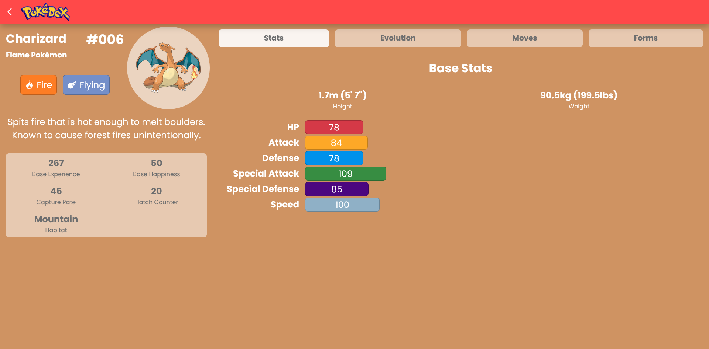
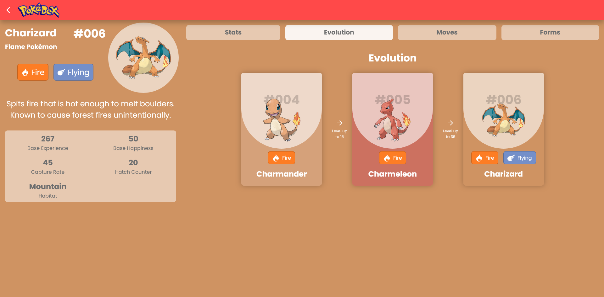
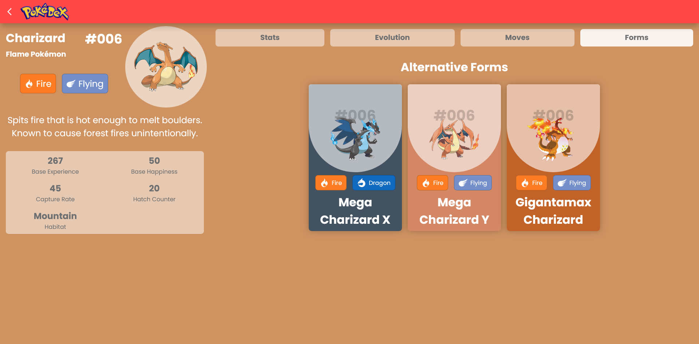
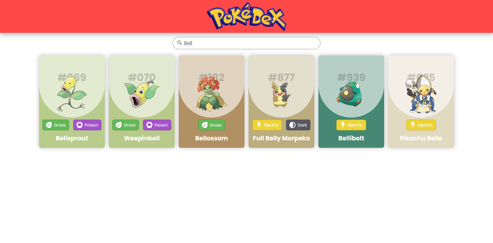
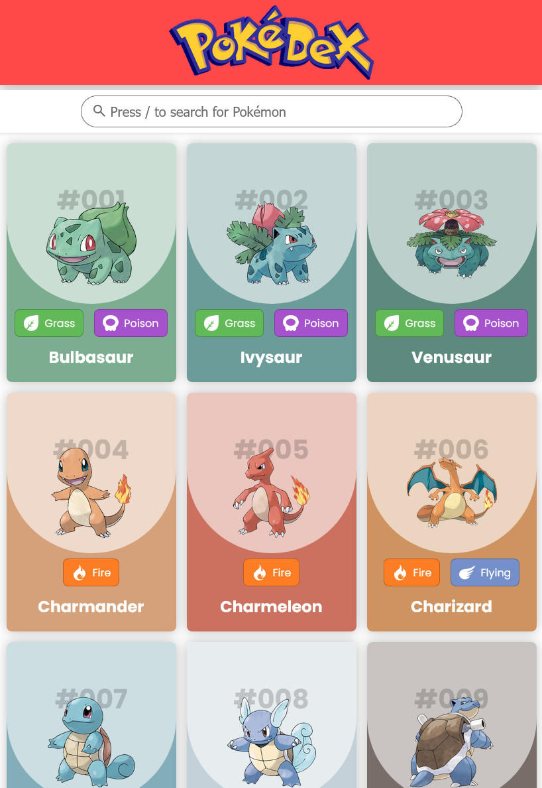
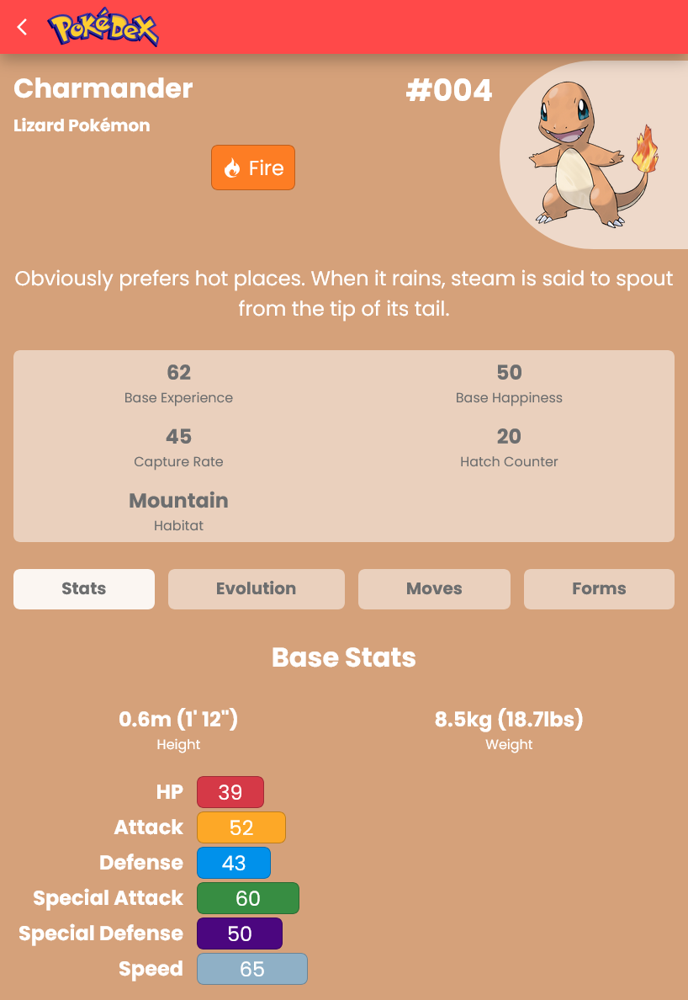
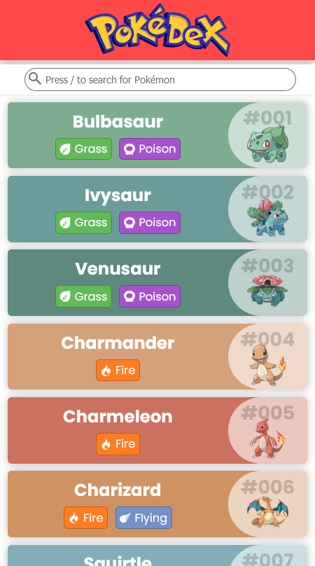
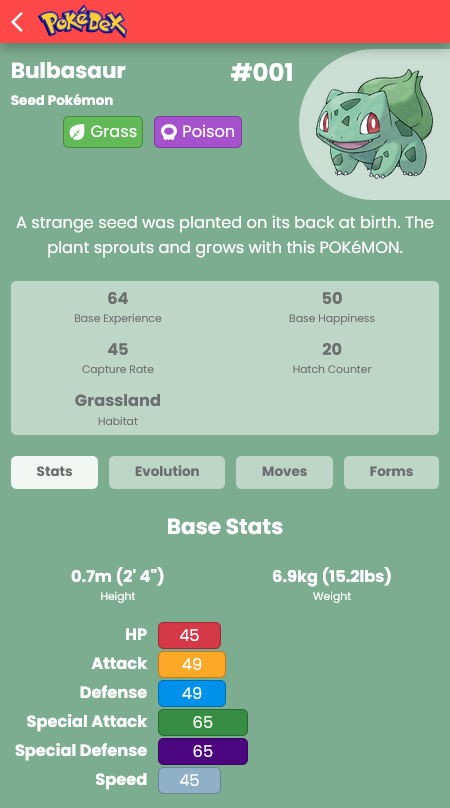

# Pokedex React app

## Overview

The Pokedex React App is a modern web application designed to provide comprehensive information about Pokemon. Built with the latest web technologies, this app offers a seamless and interactive user experience. The application leverages the power of React for building user interfaces, React Query for data fetching and state management, and React Router for navigation. TypeScript is used to ensure type safety and improve code quality. The app is styled using HTML5 and CSS3, and it is bundled with Vite for fast development and optimized production builds.

## Features

- **Responsive Design**: The app is designed to be fully responsive, ensuring it works seamlessly on both desktop and mobile devices. The layout adjusts dynamically to provide an optimal viewing experience regardless of screen size.
- **Pokemon List**: Users can view a comprehensive list of all Pokemon. The list employs infinite scrolling, allowing users to continuously load more Pokemon as they scroll down the page. This feature ensures a smooth and uninterrupted browsing experience without the need for pagination.
- **Search**: A powerful search feature allows users to quickly find specific Pokemon by name. The search functionality is designed to be fast and accurate, providing instant results as the user types.
- **Pokemon Details**: Detailed information about each Pokemon is available, including:
  - **Types**: Displays the Pokemon's types (e.g., grass, fire, water, normal).
  - **Base Experience**: Shows the base experience points gained when a Pokemon is defeated.
  - **Base Happiness**: Indicates the base happiness level of the Pokemon.
  - **Capture Rate**: Provides the likelihood of successfully capturing the Pokemon.
  - **Hatch Counter**: Shows the number of cycles required to hatch the Pokemon from an egg.
  - **Habitat**: Describes the natural habitat where the Pokemon can be found.
  - **Available Moves**: Lists all the moves that the Pokemon can learn, including level-up moves, TMs, HMs, and egg moves.
  - **Alternate Forms**: Displays any alternate forms of the Pokemon, such as different appearances or regional variants.
  - **Evolution Chains**: Shows the evolution chain of the Pokemon, including pre-evolutions and evolutions.

## Screenshots

|  |  |
|------------------------------------------------------------------|--------------------------------------------------------------------------|

|  |  |
|-----------------------------------------------------------|-------------------------------------------------------------------|

### Key Technologies

- **[React](https://react.dev/)**: A JavaScript library for building user interfaces.
- **[Tanstack Query](https://tanstack.com/query) (former React Query)**: A data-fetching library that simplifies server state management.
- **[React Router](https://reactrouter.com/)**: A library for routing in React applications.
- **[TypeScript](https://www.typescriptlang.org/)**: A typed superset of JavaScript that compiles to plain JavaScript.
- **HTML5 & CSS3**: Standard technologies for structuring and styling web content.
- **[Vite](https://vite.dev/)**: A build tool that provides a faster and leaner development experience.

### Architecture

The app follows a component-based architecture, where each part of the user interface is encapsulated in a reusable component. This modular approach makes the codebase easier to manage and scale. The management of the server state is handled using Tanstack Query, which provides hooks for fetching, caching, and updating data. React Router is used to manage navigation between different views, ensuring a smooth and responsive user experience.

### Data Source

The app uses the [PokeAPI](https://pokeapi.co/) as its primary data source. PokeAPI is a free and open API that provides detailed information about Pokemon, including their attributes, abilities, and evolutions. The app fetches data from various endpoints of the PokeAPI to display a comprehensive set of information about each Pokemon.

### User Interface

The user interface is designed to be intuitive and user-friendly. It features a responsive design that adapts to different screen sizes, ensuring a consistent experience across desktop and mobile devices. The main views include a list of all Pokemon and detailed pages for each Pokemon, showcasing their attributes, stats, and other relevant information.

### Performance

The app is optimized for performance using Vite, which provides fast hot module replacement (HMR) during development and efficient bundling for production. React Query's caching mechanism also helps in reducing redundant network requests, improving the overall performance and responsiveness of the app.

### Future Enhancements

Future enhancements for the app may include features such as:

- **Filter**: Allowing users to filter Pokemon by type, generation, etc.
- **Favorites**: Enabling users to mark their favorite Pokemon and access them quickly.
- **Battle Simulator**: Adding a feature to simulate battles between different Pokemon.
- **User Accounts**: Implementing user authentication and profiles to save preferences and progress.

## Installation

1. Clone the repository
2. Copy `.env.example` to `.env` and update the environment variables if necessary
3. Run `npm install`
4. Run `npm run dev`

## Environment Variables

The following environment variables are used in the project:

- `VITE_POKEMON_API_BASE_URL`: Base URL for the PokeAPI
- `VITE_POKEMON_SPRITES_BASE_URL`: Base URL for Pokemon sprites
- `VITE_POKEMON_ARTWORK_BASE_URL`: Base URL for official artwork
- `VITE_POKEMON_CRIES_BASE_URL`: Base URL for Pokemon cries

## Scripts

- `npm run dev`: Start the development server
- `npm run build`: Build the project for production
- `npm run lint`: Run ESLint to check for linting errors
- `npm run preview`: Preview the production build

## License

This project is open source and available under the [MIT License](LICENSE).
